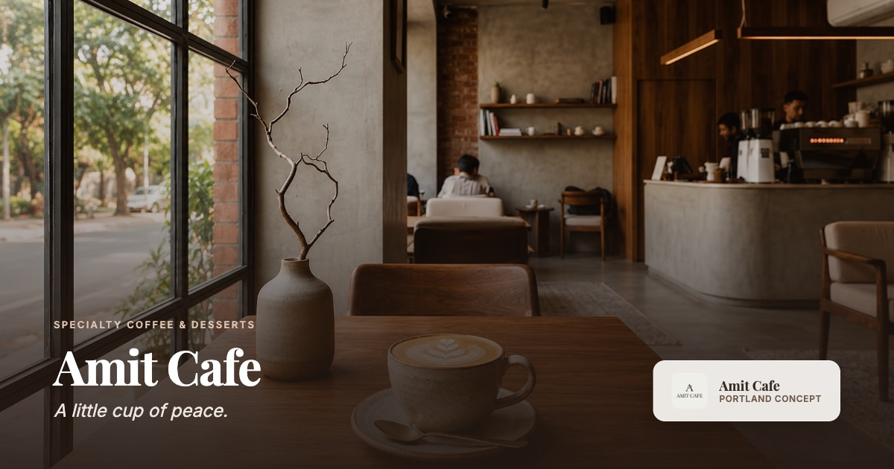

# Amit Cafe

> *"A little cup of peace."*

A polished full-stack cafe concept website combining editorial visual design with a production-ready reservation workflow.

[](https://amit-cafe.vercel.app)
[](https://nextjs.org/)
[](https://react.dev/)
[](https://www.typescriptlang.org/)
[](https://tailwindcss.com/)
[](https://supabase.com/)
[](https://resend.com/)
[](https://vercel.com/)



---

## Live Demo

**[https://amit-cafe.vercel.app](https://amit-cafe.vercel.app)**

*Note: Amit Cafe is a fictional Portland-inspired cafe concept. The reservation form is a fully functional technical demo workflow and does not reserve a physical restaurant table.*

---

## Project Overview

Amit Cafe was created to demonstrate a complete, production-grade web application that unites high-end editorial aesthetics with robust software engineering practices. Rather than a superficial static template, the project implements a complete end-to-end user and data pipeline:

* **Editorial Frontend:** Multi-page layout featuring Playfair Display and Inter typography, warm espresso/cream palettes, and responsive grid structures.
* **Interactive Reservation Pipeline:** Date-aware reservation slots, client-side state handling, server-side schema verification, and accessible error states.
* **Cloud Persistence & Communication:** PostgreSQL database persistence with row-level security boundaries and automated transactional notifications.
* **Production Polish:** Strict security headers, defense-in-depth origin validation, 100/100 Lighthouse accessibility score, and automated XML sitemap generation.

---

## Features

### Frontend & Editorial Design
* **Multi-Page Architecture:** Dedicated routes for Home (`/`), Menu (`/menu`), Our Story (`/our-story`), Moments (`/moments`), Reservations (`/reservations`), and Privacy (`/privacy`).
* **Accessible Navigation:** Glassmorphic sticky header with desktop navigation, mobile full-screen drawer with accessible keyboard focus trap (`Tab`/`Shift+Tab` cycling, `Escape` key dismissal), and standardized anchor routing.
* **Floating Ambient Motion:** Interactive customer review drift cards with `@media (prefers-reduced-motion: reduce)` fallbacks.
* **Responsive Image Optimization:** Powered by `next/image` with WebP/AVIF delivery, proportional crops, and responsive image delivery designed to minimize layout shift.
* **Branded 404 Experience:** Custom not-found route with clear return navigation.

### Reservation System
* **Dynamic Slot Availability:** 30-minute reservation intervals filtered by Portland operating hours (Mon–Thu: 8:00 AM – 10:00 PM, Fri–Sun: 8:00 AM – 11:00 PM).
* **Date Horizon Guard:** Restricts selections to valid future dates up to 30 days in advance.
* **Party Size Options:** Standard group sizes with dedicated support for larger parties (8+).
* **Human Reference Generation:** Derives a clean, readable reference code (e.g., `AC-XXXXXXXX`) from the database UUID upon confirmation.
* **Truthful Confirmation UI:** Instant feedback summarizing the requested schedule with clear demo disclaimers.

### Backend & Security
* **Next.js Route Handler:** Dedicated `POST /api/reservations` endpoint with server-side JSON request handling.
* **Perimeter Origin Guard:** Defense-in-depth same-origin guard that evaluates incoming `Origin` and `Referer` headers against dynamic deployment hosts, rejecting requests with mismatched browser context with HTTP 403.
* **Strict Schema Validation:** Server-side Zod validation with phone formatting checks, date boundary tests, and string length caps.
* **Silent Bot Honeypot:** Invisible honeypot field (`websiteHp`) hidden from sighted users and isolated from assistive technologies (`tabIndex={-1}`, `aria-hidden="true"`).
* **HTML Sanitization:** Escapes all user inputs before composing administrative notification emails.
* **HTTP Security Headers:** Live deployment headers enforcing `X-Content-Type-Options: nosniff`, `X-Frame-Options: DENY`, `Referrer-Policy: strict-origin-when-cross-origin`, `Permissions-Policy`, and HSTS.

---

## Architecture & Data Flow

```text
  [ User Browser ]
         │
         │  1. Submits Reservation Request
         ▼
  [ Next.js Route Handler: POST /api/reservations ]
         │
         │  2. Origin / Referer Guard (Rejects mismatched origins with 403)
         │  3. Honeypot Check (Rejects bot submissions)
         │  4. Zod Schema Verification (Validates date, time, party)
         │
         │  5. Database INSERT (Source of Truth)
         ▼
  [ Supabase PostgreSQL ]
  - Row-Level Security: Default Deny
  - Parameterized INSERT (Status: 'pending')
  - Generates record UUID
         │
         │  6. Owner notification attempt
         ▼
  [ Resend Email Service ]
  - HTML Sanitized Template
  - Transmits private alert to Project Owner
  - (Notification failures do not invalidate stored requests)
         │
         │  7. API Success Response (Returns stored UUID)
         ▼
  [ User Browser / Truthful Success UI ]
  - Displays human-readable reference (AC-XXXXXXXX derived from UUID)
```

* **Database as Source of Truth:** The demo reservation request is stored in Supabase before any notification is attempted. Notification delivery failures are handled gracefully and do not invalidate or revert an already stored request.
* **Reference Derivation:** The human-readable reference code (`AC-XXXXXXXX`) is derived directly from the database record UUID returned in the API success response, not generated by third-party services.
* **Secret Boundary:** Database service credentials and email API keys remain strictly server-side and are never exposed to the client.

---

## Tech Stack

| Layer | Technology | Purpose |
| :--- | :--- | :--- |
| **Framework** | Next.js 16 (App Router) | Server components, file-system routing, Turbopack |
| **UI Library** | React 19 | Declarative UI rendering, hooks, client interactivity |
| **Language** | TypeScript 5 | End-to-end static typing and interface definitions |
| **Styling** | Tailwind CSS v4 | Design system tokens, responsive utilities |
| **Database** | Supabase (PostgreSQL) | Structured data storage, Row-Level Security |
| **Validation** | Zod | Type-safe schema validation for server inputs |
| **Email** | Resend | Transactional notifications |
| **Hosting** | Vercel | Global edge network and serverless deployments |

---

## Accessibility & Performance

The live production application was verified with Chrome DevTools and Lighthouse audits:

* **Lighthouse Accessibility:** 100 / 100
* **Lighthouse Best Practices:** 100 / 100
* **Lighthouse SEO:** 100 / 100
* **Keyboard Navigation:** Native focus states across all interactive elements, escape-key accessible mobile navigation drawer with complete focus trapping.
* **Contrast Compliance:** The final accessibility audit scored 100/100 in Lighthouse, and the identified footer contrast issue was corrected to meet the applicable WCAG AA text contrast target.
* **Reduced Motion:** Floating animation drifts strictly honor the `@media (prefers-reduced-motion: reduce)` system setting.
* **Package Health:** 0 vulnerabilities reported via `npm audit`.

---

## Project Structure

```text
amit-cafe-web/
├── public/
│   └── images/amit-cafe/      # Optimized imagery, branding assets & OG card
├── src/
│   ├── app/
│   │   ├── api/reservations/  # Route handler (origin guard, Zod, Supabase, Resend)
│   │   ├── menu/              # Menu category browser
│   │   ├── moments/           # Atmosphere & aesthetic gallery
│   │   ├── our-story/         # Concept narrative
│   │   ├── privacy/           # Transparent demo data notice
│   │   ├── reservations/      # Interactive reservation form
│   │   ├── not-found.tsx      # Branded 404 page
│   │   ├── robots.ts          # Search crawler directives
│   │   ├── sitemap.ts         # Automated XML sitemap
│   │   └── layout.tsx         # Root layout, metadataBase, typography
│   ├── components/            # Reusable UI sections & navigation components
│   ├── config/                # Centralized business hours, copy & metadata
│   ├── data/                  # Menu items and category definitions
│   └── lib/
│       ├── email/             # Resend email templates & sanitization
│       ├── supabase/          # Server-only Supabase PostgreSQL client
│       └── validations/       # Zod schemas & slot calculation rules
├── next.config.ts             # Security headers & framework configuration
└── package.json
```

---

## Local Development

### Prerequisites
* Node.js 20+
* npm

### Installation

1. Clone the repository:
   ```bash
   git clone https://github.com/amit-kulkarni7/amit-cafe-web.git
   cd amit-cafe-web
   ```

2. Install dependencies:
   ```bash
   npm install
   ```

3. Configure environment variables:
   ```bash
   cp .env.example .env.local
   ```
   Populate `.env.local` with your private backend credentials:
   ```env
   SUPABASE_URL=your_supabase_project_url
   SUPABASE_SECRET_KEY=your_supabase_secret_key
   RESEND_API_KEY=your_resend_api_key
   RESERVATIONS_TO_EMAIL=your_owner_notification_email
   ```
   *(Note: The frontend runs without backend keys, but reservation submissions require valid Supabase and Resend credentials).*

4. Start the development server:
   ```bash
   npm run dev
   ```

5. Open [http://localhost:3000](http://localhost:3000) in your browser.

---

## Security & Privacy Notice

* `.env.local` is strictly ignored by Git. `.env.example` contains only empty variable names.
* Amit Cafe does not use tracking cookies, advertising beacons, or third-party behavioral analytics.
* Demonstration reservation records stored in the database are subject to periodic cleanup and are never used for commercial marketing.

---

## Status

**Production-Ready Project Showcase.**

Live Deployment: **[https://amit-cafe.vercel.app](https://amit-cafe.vercel.app)**

---

## Author

**Amit Kulkarni**  
GitHub: [@amit-kulkarni7](https://github.com/amit-kulkarni7)

